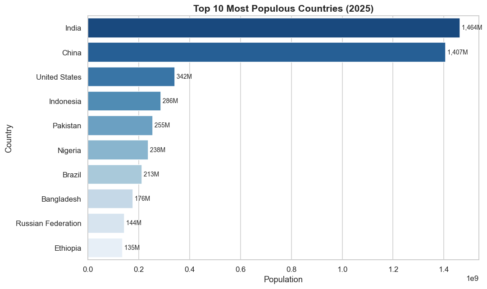
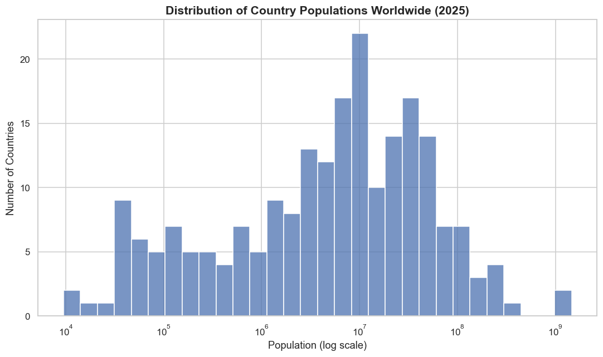

# SCT_DS_1 — Population Distribution Analysis 📊

**Data Science Internship — Task 1**
**SkillCraft Technology**

## 📌 Objective

Create a **Bar Chart** and a **Histogram** to visualize the distribution of a categorical or continuous variable, using real-world data.

## 📂 Dataset

- **Source:** [World Bank Open Data — Population, total (SP.POP.TOTL)](https://data.worldbank.org/indicator/SP.POP.TOTL)
- **Main file used:** `API_SP.POP.TOTL_DS2_EN_csv_v2_3107.csv`
- **Supporting file:** `Metadata_Country_API_SP.POP.TOTL_DS2_EN_csv_v2_3107.csv` — used to separate real countries from regional/income aggregates (like "World" or "Arab World")

## 🛠️ Tools & Libraries

- Python 3.11
- pandas
- matplotlib
- seaborn
- Jupyter Notebook

## 🔍 Approach

1. Loaded the raw World Bank CSV and inspected its structure
2. Cleaned the data:
   - Removed an empty trailing column
   - Merged with country metadata to identify and remove regional/income aggregates (e.g. "World", "Arab World"), keeping only the 217 actual countries
   - Selected 2025 — the most recent year with complete population data
3. Built a **Bar Chart** of the Top 10 most populous countries
4. Built a **Histogram** (log scale) showing how population is distributed across all 217 countries
5. Summarized insights and drew a conclusion

## 📊 Visualizations

### Bar Chart — Top 10 Most Populous Countries (2025)


### Histogram — Distribution of Population Across All Countries (2025)


## 💡 Key Insights

- **India and China dominate global population**, together far ahead of the third-largest, the United States (~340 million).
- **The distribution is heavily right-skewed** — most of the world's 217 countries have relatively small populations (median ≈ 6.5 million), while a handful of large countries pull the average much higher than the median.
- **Population is highly concentrated**: the top 10 countries alone hold a disproportionate share of the world's total population.
- A **log scale** was necessary for the histogram — on a normal scale, the billion-plus countries would compress nearly every other country into a single bar, hiding the true shape of the distribution.

## 📁 Repository Structure

```
SCT_DS_1/
├── data/                # Raw World Bank dataset (CSV files)
├── images/               # Exported chart images
├── notebook/             # Jupyter Notebook with full analysis
├── README.md
└── requirements.txt
```

## ▶️ How to Run

```bash
pip install -r requirements.txt
jupyter notebook notebook/SCT_DS_1_Population_Analysis.ipynb
```

---

Author: Yashveer Singh
Internship: SkillCraft Technology — Data Science Internship (July 2026)
